# UniNest

<p align="center">
  <a href="#app-preview"></a>
  <a href="#local-setup"></a>
  <a href="#tech-stack"></a>
</p>

<p align="center">
  
  
  
  
  
  
</p>

UniNest is a full-stack student housing and property management platform built around two user experiences:

- `Tenant`: manage shared living, raise maintenance tickets, track bills, view a calendar, and organise chores.
- `Letting Agent`: manage buildings and apartments, review maintenance issues, communicate with tenants, and monitor property activity.

The repository contains:

- an Android app in `app/`
- a Spring Boot backend in `Backend/`
- supporting machine learning assets in `UniNestModels/`

<h2 id="app-preview">App Preview</h2>

### Letting Agent Screens

<p align="center">
  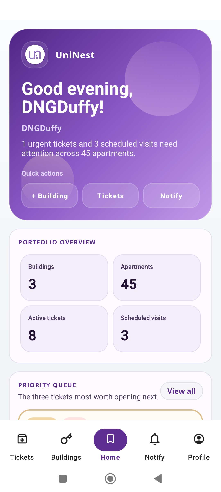
  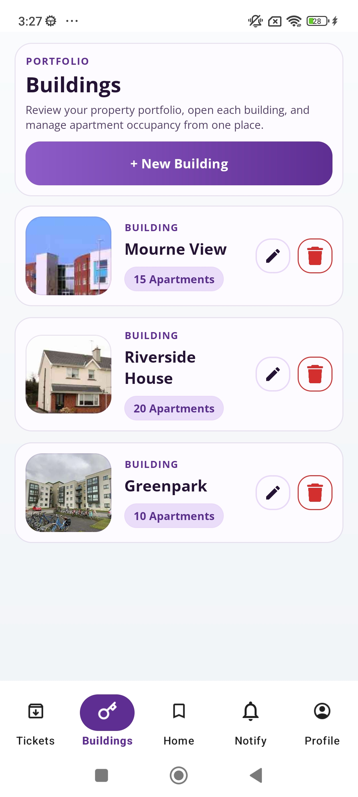
  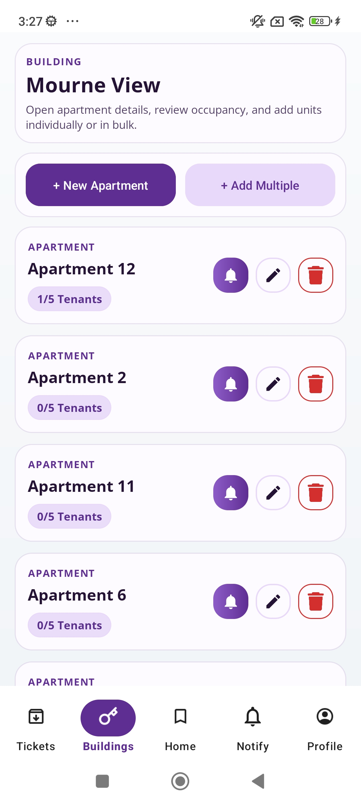
  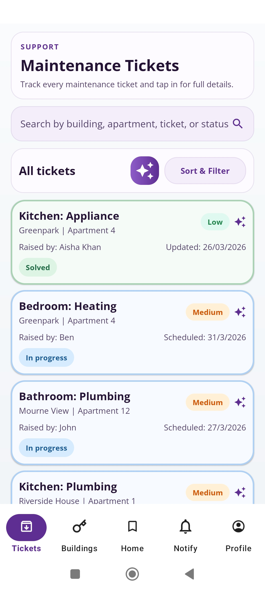
</p>

<p align="center">
  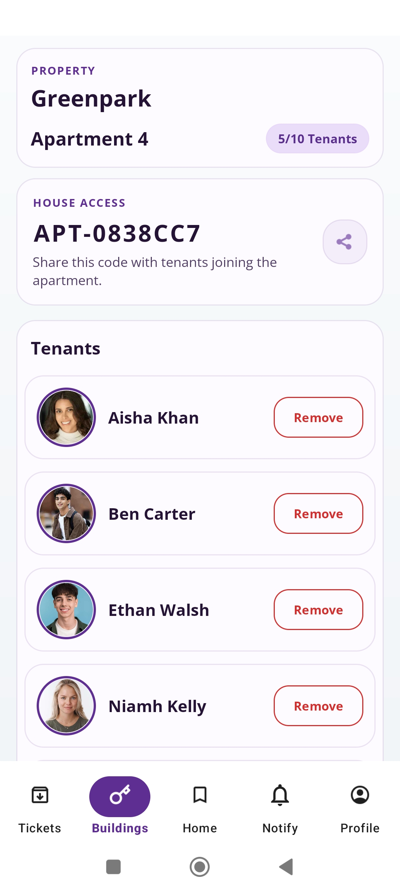
  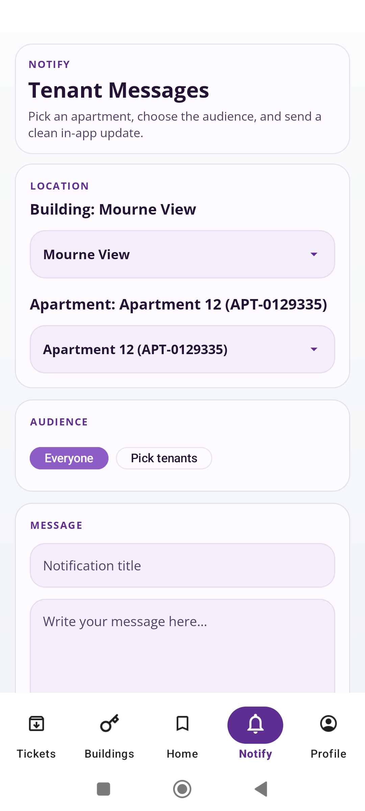
</p>

### Tenant Screens

<p align="center">
  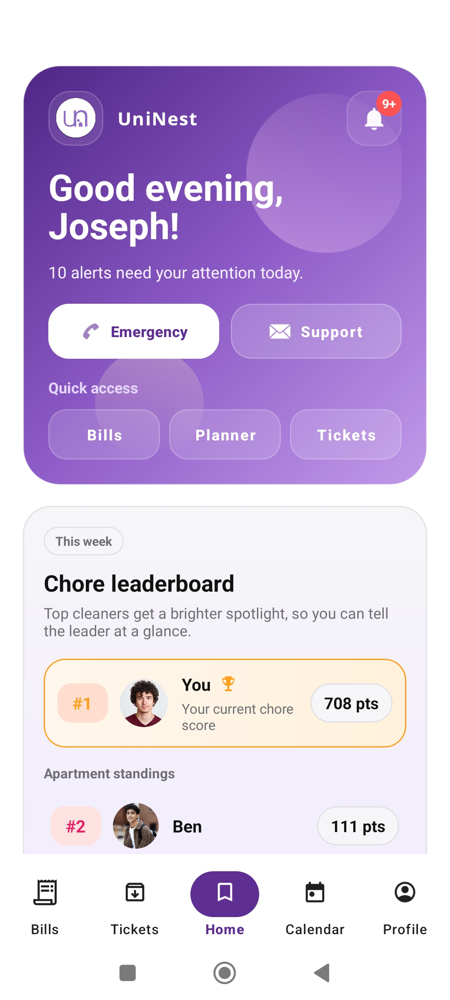
  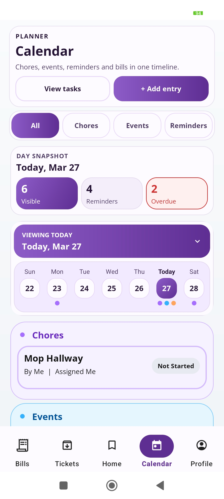
  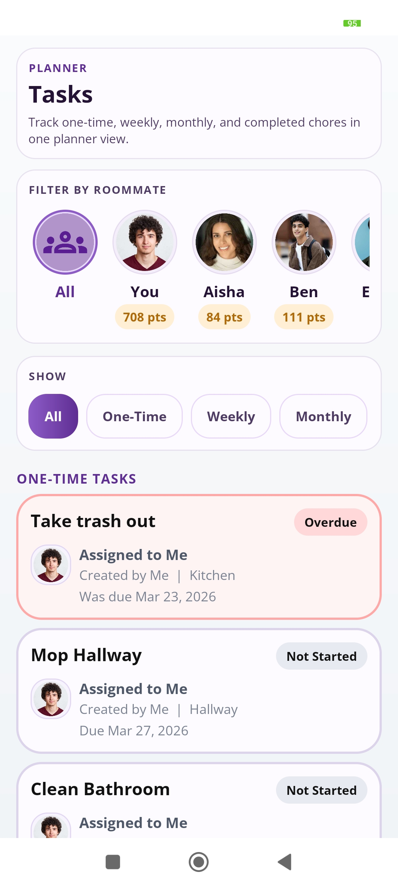
  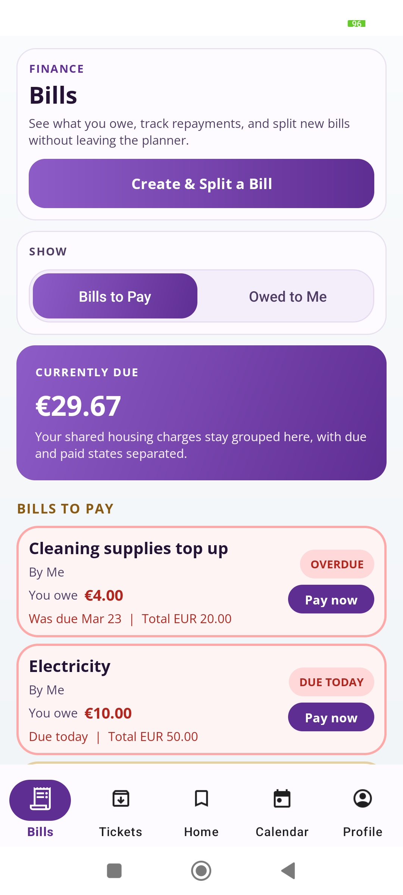
</p>

<p align="center">
  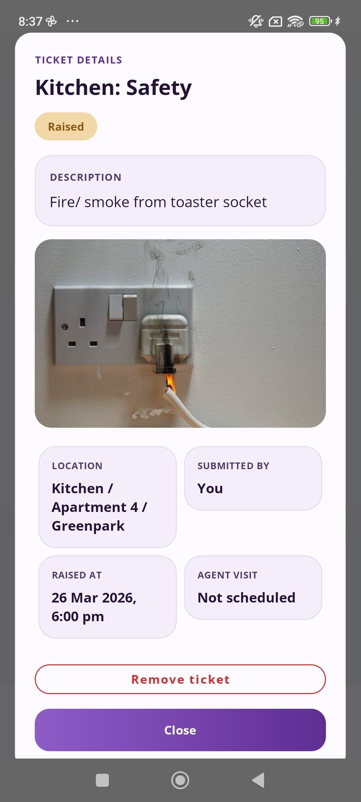
</p>

### Dark Mode Preview

<p align="center">
  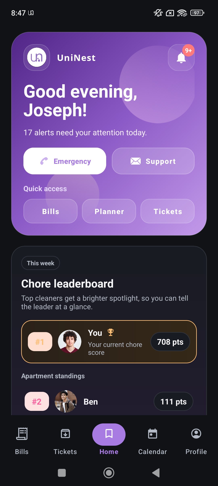
  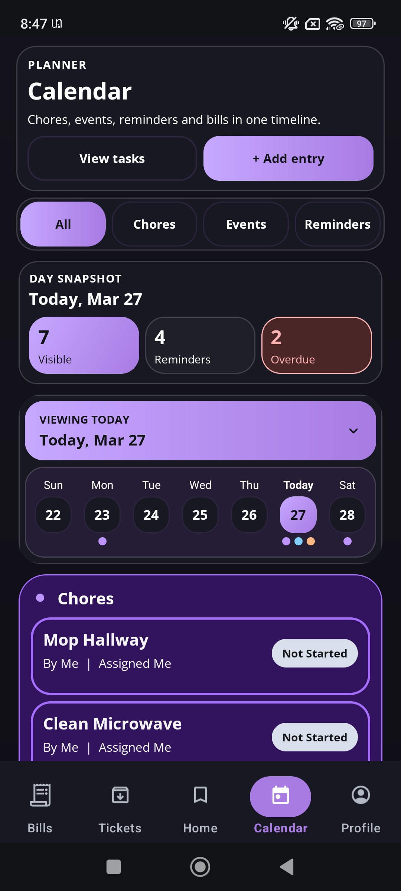
  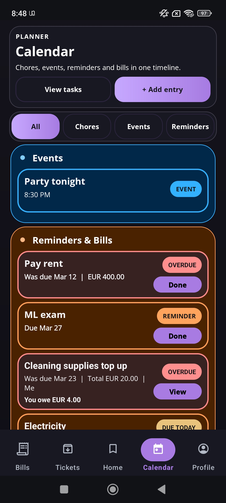
</p>

<p align="center">
  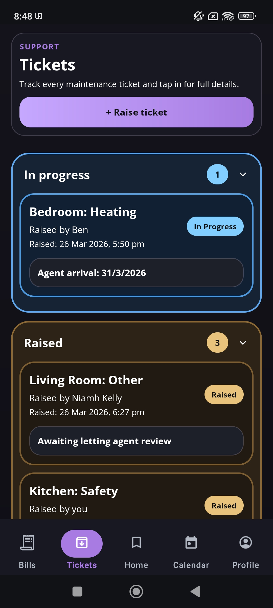
  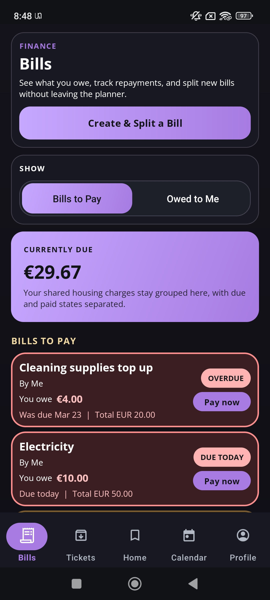
  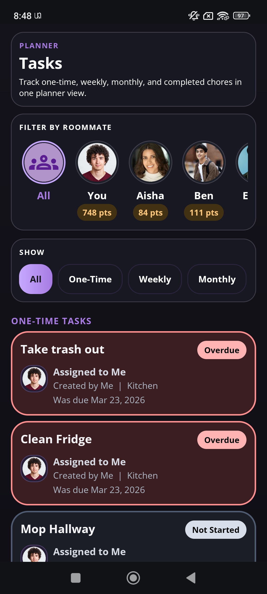
</p>

### Onboarding And Branding

<p align="center">
  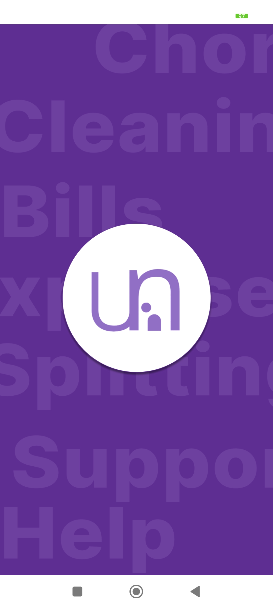
  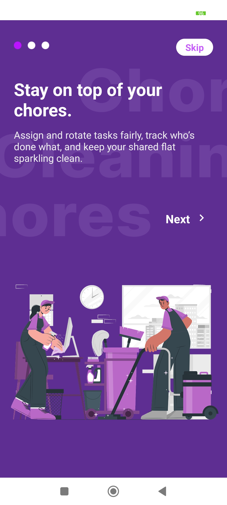
  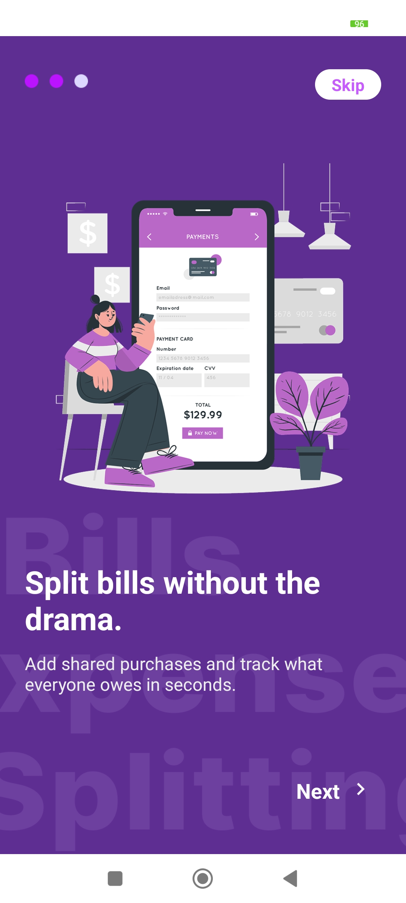
  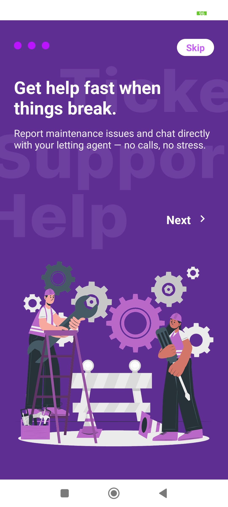
  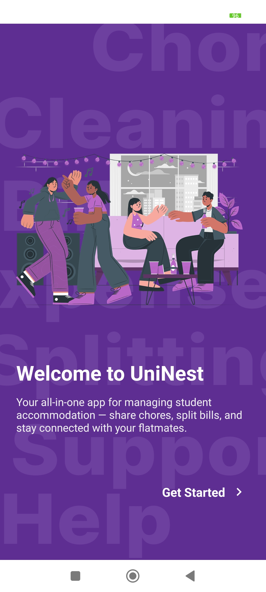
</p>

## What UniNest Does

UniNest combines day-to-day rental management with shared-house coordination features in one mobile app.

### Tenant Features

- Sign up and log in with Firebase Authentication
- Join apartments using a house code
- Raise maintenance tickets
- View ticket progress updates from the letting agent
- Split bills and track who owes what
- Use a shared apartment calendar
- Create chores manually or use smart assignment
- Receive in-app and push notifications
- Edit profile details, image, dark mode, and notification preferences

### Letting Agent Features

- Sign up and log in as a letting agent
- Create and manage buildings
- Create apartments individually or in bulk
- Add rooms and view apartment tenants
- View maintenance tickets by building and apartment
- Update ticket status, priority, response notes, and visit dates
- Send broadcast or targeted notifications to tenants

### Smart Features

- AI-assisted maintenance ticket priority prediction on Android using TensorFlow Lite + Chaquopy Python preprocessing
- Smart chore assignment through a backend scheduling service that calls a deployed model endpoint and falls back to workload balancing if needed
- Push notifications through Firebase Cloud Messaging
- Error monitoring through Sentry

<h2 id="tech-stack">Tech Stack</h2>

### Mobile App

- Java-based Android app
- Android SDK 34
- Min SDK 26
- Retrofit + Gson for API calls
- Firebase Auth, Firestore, Realtime Database, Storage, Messaging, and App Check
- TensorFlow Lite for on-device ticket priority prediction
- Chaquopy for embedded Python preprocessing

### Backend

- Java 17
- Spring Boot 3
- Spring Security
- Firebase Admin SDK
- Firestore as the main data store
- Bucket4j for abuse protection / rate limiting
- Jsoup + Apache Commons Text for sanitization support
- Sentry for backend monitoring

### ML / AI Assets

- Ticket priority model packaged in the Android app assets
- Chore scheduling model assets and standalone Python service under `UniNestModels/ChoreScheduling`

## Architecture Overview

```text
Android App
  -> Firebase Authentication
  -> Spring Boot Backend
      -> Firestore
      -> Firebase Cloud Messaging
      -> Chore scheduling model service

Android App
  -> On-device ticket priority model (TensorFlow Lite + Python tokenizer)
```

### How It Works

1. A user signs in through Firebase Authentication.
2. The Android app sends authenticated requests to the Spring Boot backend.
3. The backend verifies Firebase tokens, applies role-based access rules, and reads/writes to Firestore.
4. Maintenance, bills, chores, apartments, buildings, and calendar events are stored centrally in Firebase.
5. Notifications are saved to Firestore and optionally pushed to devices via Firebase Cloud Messaging.
6. Smart chore assignment is handled by the backend scheduling service.
7. Ticket priority prediction is performed on-device before ticket submission.

## Repository Structure

```text
UniNest/
|-- app/                         # Android application
|-- Backend/                     # Spring Boot backend
|-- UniNestModels/               # Model files, training assets, and AI services
|   |-- ChoreScheduling/         # Standalone chore prediction service
|-- docs/                        # Docs and images
|   |-- images/                  # README screenshots
|-- tools/                       # Utility scripts / helper tools
|-- build.gradle.kts             # Root Gradle config
|-- settings.gradle.kts          # Root multi-module config
```

## Prerequisites

Before running the project locally, make sure you have:

- Android Studio installed
- JDK 17 installed
- Android SDK for API 34
- A Firebase project configured for the Android app and backend
- A valid `google-services.json` for the Android app
- A Firebase service account key for local backend development, or Google Application Default Credentials
- Internet access for Firebase and any deployed backend/model services

<h2 id="local-setup">Local Setup</h2>

### 1. Clone The Repository

```bash
git clone <your-repo-url>
cd UniNest
```

### 2. Android App Setup

#### Firebase Config

The Android app expects a Firebase config file at:

```text
app/google-services.json
```

That file is ignored by Git and should not be committed.

If your downloaded Firebase config currently has a name like `google-services (3).json`, rename it to:

```text
google-services.json
```

and place it inside the `app/` folder.

#### API Base URL

Update the backend URL in:

```java
app/src/main/java/com/example/uninest/data/api/ApiClient.java
```

depending on how you are testing locally.

##### Option 1: Laptop And Phone On The Same Wi-Fi

Change `BASE_URL` to your laptop's Wi-Fi IP address, for example:

```java
public static final String BASE_URL = "http://192.168.1.90:8080/";
```

In this setup:

- both your laptop and phone should be connected to the same Wi-Fi
- the IP should be your laptop's local Wi-Fi IP address
- the backend should be running on port `8080`

##### Option 2: Hotspot / `adb reverse`

Change `BASE_URL` to:

```java
public static final String BASE_URL = "http://127.0.0.1:8080/";
```

Then run the backend:

```powershell
.\gradlew.bat clean bootRun
```

After that, open Command Prompt and run:

```text
cd "C:\Users\megha\AppData\Local\Android\Sdk\platform-tools"
.\adb.exe reverse tcp:8080 tcp:8080
```

Change the `platform-tools` path if your Android SDK is installed somewhere else.

This setup is useful when testing through hotspot or when you want the phone to access your local backend through `adb reverse`.

##### Optional: Deployed Backend

If you want to use the deployed backend instead of running locally, switch `BASE_URL` back to the hosted URL.

#### Build The App

This project defines two product flavors:

- `tenantDebug`
- `agentDebug`

Build from the project root:

```bash
./gradlew assembleTenantDebug
./gradlew assembleAgentDebug
```

On Windows PowerShell:

```powershell
.\gradlew assembleTenantDebug
.\gradlew assembleAgentDebug
```

You can also run the correct app from Android Studio using Build Variants:

##### Select Build Variants

1. Open the Build Variants tool window:

```text
View > Tool Windows > Build Variants
```

2. Find the `:app` module.
3. In the `Active Build Variant` column, choose:

- `tenantDebug` to install the tenant app
- `agentDebug` to install the property manager / letting agent app

4. Run the app from Android Studio.

### 3. Backend Setup

The backend lives in:

```text
Backend/
```

#### Firebase Admin Credentials

For local development, place your Firebase service account key at:

```text
Backend/src/main/resources/serviceAccountKey.json
```

This file is ignored by Git.

The backend is coded to:

- use `serviceAccountKey.json` locally if it exists
- fall back to Google Application Default Credentials when deployed

#### Run The Backend

From the project root:

```bash
./gradlew :Backend:bootRun
```

Or from inside the backend directory:

```bash
cd Backend
./gradlew bootRun
```

On Windows PowerShell:

```powershell
.\gradlew :Backend:bootRun
```

The backend runs on:

```text
http://localhost:8080
```

because `server.port` defaults to `8080`.

### 4. Optional Chore AI Service

The backend chore scheduling service currently points to a deployed endpoint:

```text
https://uninest-ai-service-369284273825.europe-west1.run.app/predict
```

If you want to run or retrain the standalone Python chore service locally, see:

```text
UniNestModels/ChoreScheduling/
```

That folder contains:

- `app.py`
- `requirements.txt`
- model files
- Dockerfile / Cloud Build config

## Running The Project

### Recommended Local Workflow

1. Start the Spring Boot backend.
2. Make sure Firebase config files are in place.
3. Update the Android `BASE_URL` if needed.
4. Run the Android app in `tenantDebug` or `agentDebug`.
5. Log in with Firebase-backed users that exist in your Firestore data.

## Authentication And Roles

UniNest uses Firebase Authentication and backend-side role enforcement.

- The backend exposes `/auth/firebase-login` to sync Firebase users with role claims.
- Role values are mapped into `TENANT` and `LETTINGAGENT`.
- Most backend routes require a valid Firebase token.
- Spring Security protects all non-public endpoints.

## Core Backend Modules

### Buildings And Apartments

- Create buildings
- Create apartments
- Bulk-create apartments with room setup
- View apartments by building
- Add rooms and manage tenants by house code

### Tickets

- Create tickets
- View tickets by building, apartment, or landlord
- Update ticket status
- Update ticket priority
- Add agent response and visit date
- Soft-delete tenant tickets instead of fully removing them

### Bills

- Create bills
- View active bills
- View payment history
- Track total owed and money owed back

### Calendar

- Create events
- Fetch apartment and user calendars
- Update and delete events
- Ticket visit updates can create reminder events

### Chores

- List chores by apartment
- Assign chores with AI assistance
- Add chores with manual assignment
- Update chore completion status

### Notifications

- Register device tokens
- Send notifications to selected users
- Save notification history to Firestore
- Push updates through Firebase Cloud Messaging

## Testing

### Backend Tests

The backend includes controller, flow, authentication, sanitization, and security tests.

Run them with:

```bash
./gradlew :Backend:test
```

On Windows PowerShell:

```powershell
.\gradlew :Backend:test
```

### Android Tests

The Android module includes basic unit and instrumentation test scaffolding.

Run unit tests with:

```bash
./gradlew :app:test
```

Run instrumented tests with:

```bash
./gradlew :app:connectedAndroidTest
```

## Deployment

### Backend

The backend includes:

- `Backend/Dockerfile`
- `Backend/cloudbuild.yaml`

This supports container builds and deployment to Google Cloud Run.

### Chore Model Service

The chore scheduling service also includes Docker and Cloud Build files for deployment.

## Known Setup Notes

- `app/google-services.json` is required locally and is intentionally not committed.
- `Backend/src/main/resources/serviceAccountKey.json` is required for local Firebase Admin access unless you use Application Default Credentials.
- When testing on a real phone over Wi-Fi, use your laptop's local Wi-Fi IP in `ApiClient.BASE_URL`.
- When testing with `adb reverse`, use `http://127.0.0.1:8080/` and run the reverse port command from `platform-tools`.
- README images use relative paths from `docs/images/`, so they render on GitHub once those files are committed in the same branch.
- Some monitoring values such as Sentry DSNs are present in project configuration; review them before sharing the repository publicly.

## Closing Note

UniNest brings together property management and shared student living tools in one experience, making it easier for tenants and letting agents to stay organised, communicate clearly, and manage day-to-day tasks in a more connected way.

If you are exploring the project for learning, collaboration, or further development, this repository gives a full view of the Android app, backend services, and supporting AI features that power the platform.
